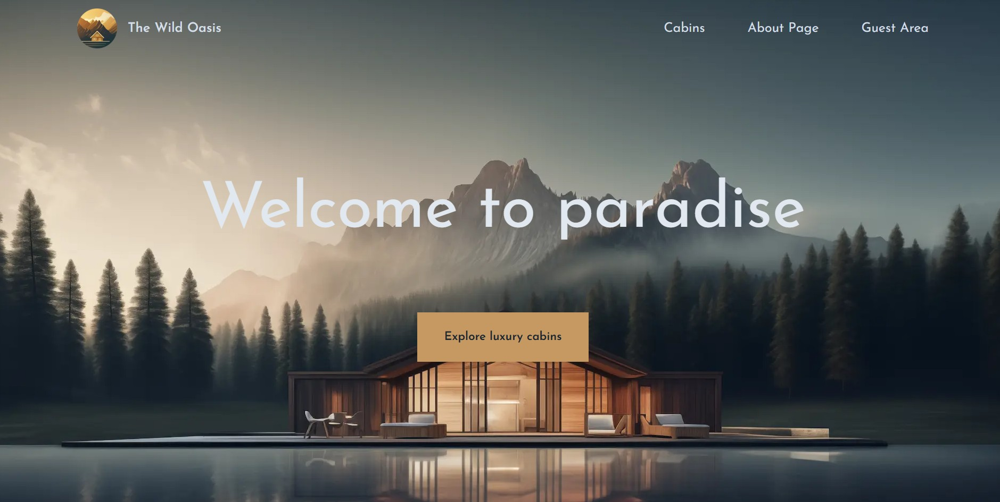
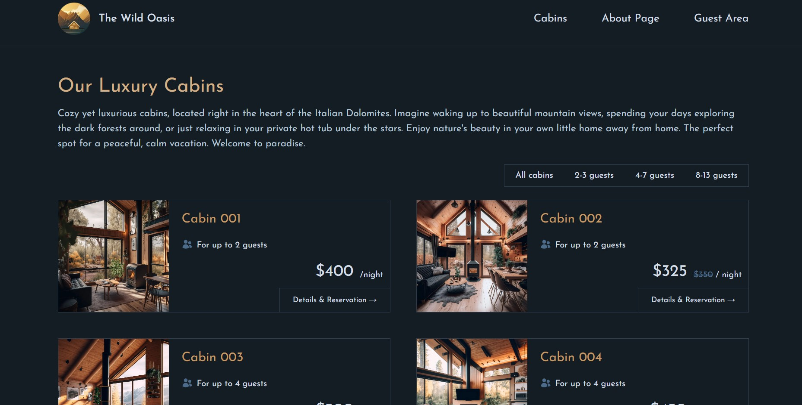
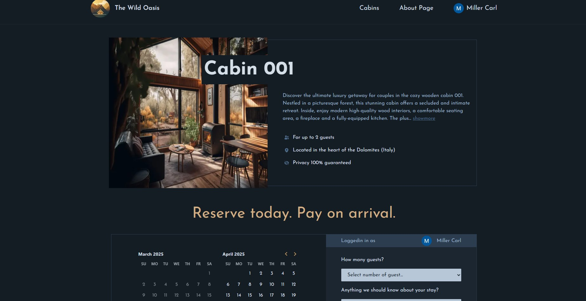
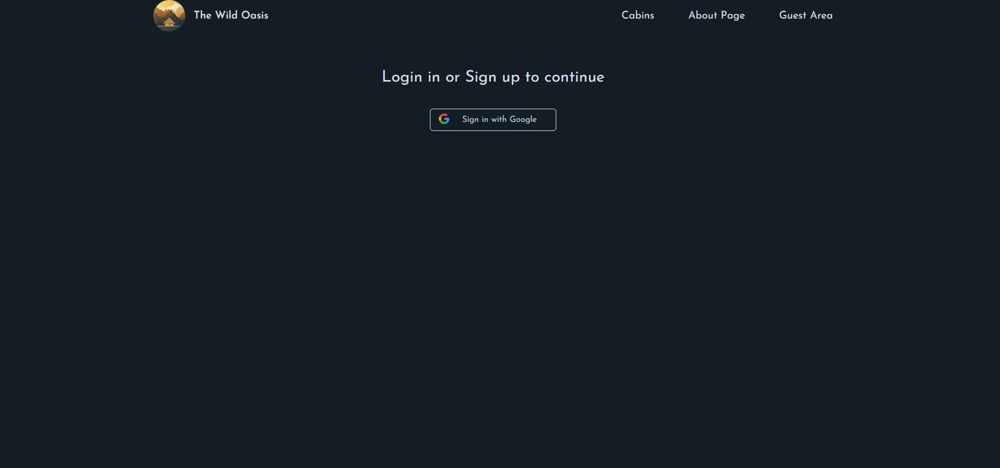

# Wild Oasis

Welcome to the Wild Oasis! Wild Oasis is a hotel booking app, allowing users to search and reserve accommodations with a user-friendly interface.

This project is a full-stack project built with **Next.js** and styled using **Tailwind CSS**. It leverages **Auth.js** along with Google **OAuth** for secure user authentication, while **Supabase** powers the backend to efficiently handle data fetching and posting. This setup delivers a responsive, reliable, and secure user experience.

The Admin Penal part of this website sharing the same database can be found here:
https://github.com/yiwenwangANU/wild-oasis-v2
This project was built following the course on udemy:
https://www.udemy.com/course/the-ultimate-react-course/

## Features ✨

- **Responsive UI:** Developed with Next.js and styled using Tailwind CSS

- **Data Management:** Integrated Supabase for data fetching and posting.

- **Authentication:** Protect routes using NextAuth middleware.

- **Authorization :** Login user using Google OAuth, logined user is authorized to book the cabins

## Preview









## Getting Started 🚀

### Installation

Clone the repository and install the dependencies:

```

git clone https://github.com/yiwenwangANU/wild-oasis-website.git

cd rest_api_frontend

npm install

```

### Environment Variables

Create .env.local file in the root dir that contains the following variables

- `AUTH_GOOGLE_ID` for Google OAuth
- `AUTH_GOOGLE_SECRET` for Google OAuth
- `NEXTAUTH_SECRET` for NextAuth
- `NEXTAUTH_URL` for NextAuth
- `SUPABASE_KEY` for supabase access
- `SUPABASE_URL` for supabase access

### Running Locally

Start the development server:

```

npm run dev

```

Your app will be available at http://localhost:3000.
